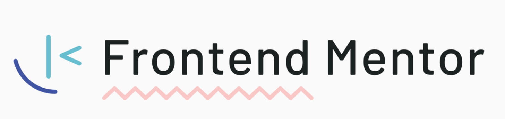

<!-- markdownlint-disable MD033 -->
<!-- markdownlint-disable MD041 -->

  

 

  
  
  
  

# `Frontend Mentor Challenges`

All the challenges listed were designed by [Frontend Mentor](https://www.frontendmentor.io/home). The projects were developed by me through the preconceived models in the preview image.

To know or consult the challenges, access <https://www.frontendmentor.io/challenges>.

   
  <table>
    <thead>
      <tr>
        <th align="center">
          
          

            <code>#</code>
          

        </th>
        <th align="center">
          
          

            <code>challenge</code>
          

        </th>
        <th align="center">
          
          

              <code>preview</code>
          

        </th>
        <th align="center">
            
            

                <code>deploy</code>
            

        </th>
      </tr>
    </thead>
    <tbody>
        <tr>
          <td><code>01</code></td>
          <td><a href="https://github.com/mgckaled/frontend-mentor-challenges/tree/main/qr-code-component" target="_blank" rel="noopener noreferrer"><code>qr code component</code></a></td>
          <td align="center"></td>
          <td align="center"></td>
        </tr>
        <tr>
          <td><code>02</code></td>
          <td><a href="https://github.com/mgckaled/frontend-mentor-challenges/tree/main/easybank" target="_blank" rel="noopener noreferrer"><code>easybank</code></a></td>
          <td align="center"></td>
          <td align="center"></td>
        </tr>
    </tbody>
  </table>

