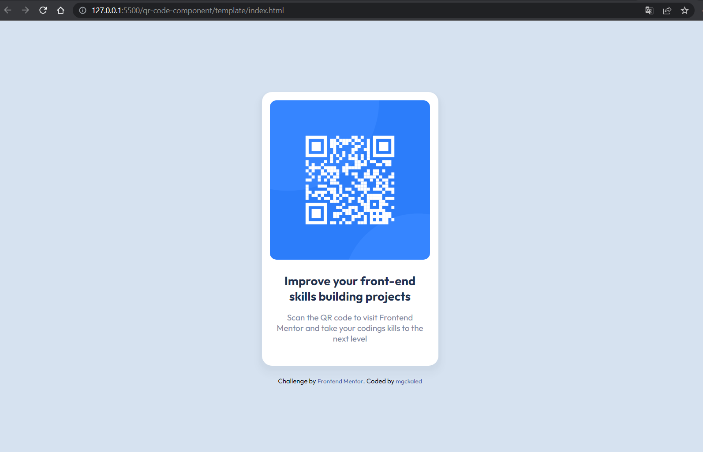

# Frontend Mentor - QR code component solution

This is a solution to the [QR code component challenge on Frontend Mentor](https://www.frontendmentor.io/challenges/qr-code-component-iux_sIO_H).

> Frontend Mentor challenges help you improve your coding skills by building realistic projects.

## Overview

### Screenshot

### Links

- Solution URL [HERE](https://github.com/mgckaled/frontend-mentor-challenges/tree/main/qr-code-component)
- Live Site URL [HERE](https://mgckaled.github.io/frontend-mentor-challenge/qr-code-component/template/)

## My process

### Built with

- Semantic HTML5 markup
- CSS custom properties (`font-size: 62.5%;`)
- Flexbox
- Mobile-first workflow

## Author

- Frontend Mentor - [@mgckaled](https://www.frontendmentor.io/profile/mgckaled)

---

Made with ❤️ by [mgckaled](https://github.com/mgckaled)
